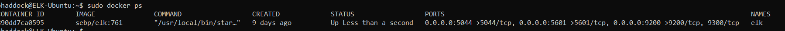
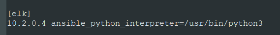

## Automated ELK Stack Deployment

The files in this repository were used to configure the network depicted below.

These files have been tested and used to generate a live ELK deployment on Azure. They can be used to either recreate the entire deployment pictured above. Alternatively, select portions of the playbook file may be used to install only certain pieces of it, such as Filebeat.

  - _[Elk Install](Ansible/elk_install.yml)_
  - _[DVWA](Ansible/dvwa_playbook.yml)_
  - _[FileBeat](Ansible/filebeat_playbook.yml)_
  - _[MetricBeat](Ansible/metric_playbook.yml)_

This document contains the following details:
- Description of the Topology
- Access Policies
- ELK Configuration
  - Beats in Use
  - Machines Being Monitored
- How to Use the Ansible Build

### Description of the Topology

The main purpose of this network is to expose a load-balanced and monitored instance of DVWA, the D*mn Vulnerable Web Application.

Load balancing ensures that the application will be highly available, in addition to restricting access to the network.
- _A jumpbox or bastion server serves as a gatway to gain entry into a remote network. Many times the primary mode of access is ssh and without the key access is forbidden_
- _A loadbalancer is meant to serve as a specific point of access for a service that is served by multiple machines.  This allows high availability models to function properly_

Integrating an ELK server allows users to easily monitor the vulnerable VMs for changes to the log files and system resources.
- _Filebeat is meant primarily to watch for system logs and forward any changes to the Elasticsearch Host_
- _Metricbeat is used only for gathering metrics and system resources usage for display in Elasticsearch_

The configuration details of each machine may be found below.

| Name     | Function            | IP Address | Operating System |
|----------|---------------------|------------|------------------|
| Jump Box | Gateway             | 10.0.0.4   | Ubuntu           |
| Web1     | Web Server          | 10.0.0.9   | Ubuntu           |
| Web2     | Web Server          | 10.0.0.10  | Ubuntu           |
| Web3     | Web Server          | 10.0.0.6   | Ubuntu           |
| ELK      | ElasticSearch Stack | 10.2.0.4   | Ubuntu           |

### Access Policies

The machines on the internal network are not exposed to the public Internet.

Only the jumpbox/bastion machine can accept connections from the Internet. Access to this machine is only allowed from the following IP addresses:
- _24.2.74.127_

Machines within the network can only be accessed by the jumpbox or bastion host.
- _Jumpbox_
  - _PublicIP: 65.52.120.10_
  - _PrivateIP: 10.0.0.4_

A summary of the access policies in place can be found in the table below.

| Name     | Publicly Accessible | Allowed IP Addresses |
|----------|---------------------|----------------------|
| Jump Box | Yes/No              | 10.0.0.1 10.0.0.2    |
|          |                     |                      |
|          |                     |                      |

### Elk Configuration

Ansible was used to automate configuration of the ELK machine. No configuration was performed manually, which is advantageous because...
- _It allows for full automation of a specific server and reduces configuration errors_

The playbook implements the following tasks:
- _Install Docker: Installs the core docker code to the remote server_
- _Install Python3_pip: Pip is an installation module that allows for additional docker modules to be installed easier_
- _Docker Module: Tells the previous PIP module to install the necessary docker component modules_
- _Increase Memory/Use More Memory: A common issue with the ELK Docker image is to little memory.  This help fix the issue to allow the server to launch_
- _Download and Launch ELK Container: This downloads the ELK docker container and initializes it with the specified ports being published_

The following screenshot displays the result of running `docker ps` after successfully configuring the ELK instance.

### Target Machines & Beats
This ELK server is configured to monitor the following machines:
- _The elk Server monitors the following IPS_
  - 10.0.0.9
  - 10.0.0.10
  - 10.0.0.6
  - 10.2.0.4

We have installed the following Beats on these machines:
- _We have installed Filebeat and Metricbeat on the following Systems: Web1, Web2, Web3, ELK_
  - _ELK wasn't part of the requirements but it doesn't hurt to self monitor in case access is gained to that server_

These Beats allow us to collect the following information from each machine:
- _Filebeats collects system type events such as logins to see who is actively logging into the system._
  - [See here for Filebeats Example](Images/filebeats_logs.png)
- _Metricbeats collects useful information such as cpu usage and memory, this is particularly useful when seeing if there are any aberant programs or behaviors taking system resources_
  - [See here for MetricBeats Example](Images/metricbeats_example.png)

### Using the Playbook
In order to use the playbook, you will need to have an Ansible control node already configured. Assuming you have such a control node provisioned:

SSH into the control node and follow the steps below:
- Copy the _____ file to _____.
- Update the _____ file to include...
- Run the playbook, and navigate to ____ to check that the installation worked as expected.

Answers:
- _Copy the elk_install.yml file to /etc/ansible/roles/elk_install.yml_
- _Update the hosts file to include the attribute, such as [elk], then include your destination ip of the ELK server directly below._
  - 
  - [Also example host file](Ansible/hosts.txt)
- _Run the playbook, and navigate to http://[your_elk_server_ip]:5601/app/kibana to check that the installation worked as expected._

_As a **Bonus**, provide the specific commands the user will need to run to download the playbook, update the files, etc._
